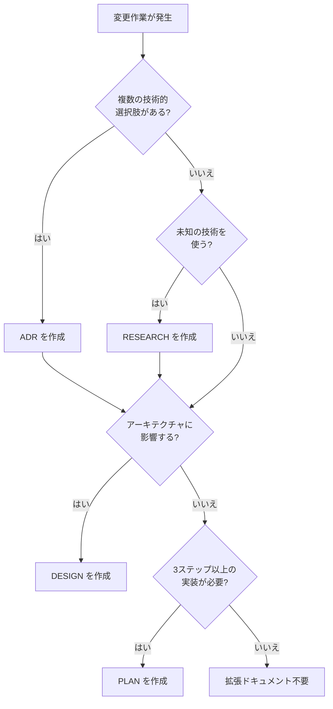

# 拡張ドキュメント型リファレンス

SPEC の下に配置する拡張ドキュメント型（DESIGN / PLAN / ADR / RESEARCH）の
定義、テンプレート、セットアップ手順、使い分けガイドを記載する。

---

## Doorstop セットアップ手順

### 初回セットアップ（プロジェクトごとに1回のみ）

拡張ドキュメント型を使用するには、Doorstop でドキュメントを作成する必要がある。
**必要な型のみ作成すればよい**（全て必須ではない）。

```bash
# DESIGN ドキュメント（アーキテクチャ・設計）
doorstop create DESIGN ./specification/designs --parent SPEC

# PLAN ドキュメント（実装計画）
doorstop create PLAN ./specification/plans --parent SPEC

# ADR ドキュメント（技術選定記録）
doorstop create ADR ./specification/adrs --parent SPEC

# RESEARCH ドキュメント（調査メモ）
doorstop create RESEARCH ./specification/research --parent SPEC
```

### `.doorstop.yml` の確認

各ディレクトリに生成される `.doorstop.yml` を確認し、`sep: '-'` を設定する:

```yaml
settings:
  digits: 3
  prefix: DESIGN    # または PLAN / ADR / RESEARCH
  sep: '-'           # ← Spec-Weaver対応でダッシュを使う
```

### セットアップ後のディレクトリ構成

```text
specification/
├── reqs/              # REQ（ビジネス要件）
├── specs/             # SPEC（システム仕様）
├── features/          # Gherkin .feature ファイル
├── designs/           # DESIGN（設計ドキュメント）
├── plans/             # PLAN（実装計画）
├── adrs/              # ADR（技術選定記録）
└── research/          # RESEARCH（調査メモ）
```

---

## DESIGN（設計ドキュメント）

### 用途

- アーキテクチャ設計、コンポーネント分解
- モジュール間のインターフェース定義
- データフロー、シーケンスの設計

### いつ作るか

- 2つ以上のモジュールに影響する変更
- 新しいアーキテクチャパターンを導入する場合
- 既存のアーキテクチャを大幅に変更する場合

### 作成手順

```bash
doorstop add DESIGN
doorstop link DESIGN-001 SPEC-001   # 関連するSPECにリンク
doorstop edit DESIGN-001
```

### text テンプレート

```yaml
active: true
status: draft
created_at: 'YYYY-MM-DD'
updated_at: 'YYYY-MM-DD'
links:
- SPEC-001
text: |
  ## 概要
  （この設計ドキュメントの一文サマリー）

  ## コンテキスト
  （なぜこの設計が必要か。関連するSPECの概要）

  ## アーキテクチャ

  ### コンポーネント図
  ```mermaid
  graph TD
      A[コンポーネントA] --> B[コンポーネントB]
      A --> C[コンポーネントC]
      B --> D[データストア]
  ```

  ### インターフェース定義

  | インターフェース | 入力 | 出力 | 説明 |
  |---|---|---|---|
  | （名前） | （型） | （型） | （説明） |

  ## データフロー
  ```mermaid
  sequenceDiagram
      participant U as ユーザー
      participant A as コンポーネントA
      participant B as コンポーネントB
      U->>A: リクエスト
      A->>B: 処理委譲
      B-->>A: 結果
      A-->>U: レスポンス
  ```

  ## 制約・前提条件
  - （技術的制約）
  - （パフォーマンス要件）

  ## 影響範囲
  - （変更が影響するモジュール一覧）
```

---

## PLAN（実装計画）

### 用途

- 実装タスクの分解と順序定義
- 依存関係の明示
- 進捗の追跡

### いつ作るか

- 3つ以上のファイルを変更する実装作業
- 複数ステップに分かれる実装
- チームで作業を分担する場合

### 作成手順

```bash
doorstop add PLAN
doorstop link PLAN-001 SPEC-001   # 関連するSPECにリンク
doorstop edit PLAN-001
```

### text テンプレート

```yaml
active: true
status: draft
created_at: 'YYYY-MM-DD'
updated_at: 'YYYY-MM-DD'
links:
- SPEC-001
text: |
  ## 概要
  （この実装計画の一文サマリー）

  ## 対象SPEC
  - SPEC-001: （概要）

  ## 前提条件
  - （実装を開始するために必要な条件）

  ## タスク一覧

  | # | タスク | 対象ファイル | 依存 | 完了条件 |
  |---|---|---|---|---|
  | 1 | （タスク名） | `src/xxx.py` | — | （条件） |
  | 2 | （タスク名） | `src/yyy.py` | #1 | （条件） |
  | 3 | （タスク名） | `tests/xxx.py` | #1,#2 | テスト通過 |
  | 4 | 仕様の更新 | `specification/` | #1-#3 | audit 通過 |

  ## 実装順序
  ```mermaid
  graph TD
      T1[#1 タスク名] --> T2[#2 タスク名]
      T1 --> T3[#3 テスト]
      T2 --> T3
      T3 --> T4[#4 仕様更新]
  ```

  ## リスク・注意点
  - （実装中に注意すべき点）
```

### Plan-as-Spec の利点

PLANドキュメントを Doorstop に永続化することで:

- **変更履歴の追跡**: Git で計画の変遷が記録される
- **トレーサビリティ**: SPEC との紐付けにより「なぜこのタスクが必要か」が明確
- **再利用**: 類似機能の実装時に過去の計画を参照できる
- **事後記録**: 完了後も「どう実装したか」のドキュメントとして残る

---

## ADR（Architecture Decision Record）

### 用途

- 技術選定の理由と経緯の記録
- 却下した選択肢とその理由
- 決定がもたらす帰結の明示

### いつ作るか

- 複数の技術的選択肢から1つを選ぶ場合
- フレームワーク、ライブラリ、パターンの選定
- 既存のアーキテクチャ決定を変更する場合

### 作成手順

```bash
doorstop add ADR
doorstop link ADR-001 SPEC-001   # 関連するSPECにリンク
doorstop edit ADR-001
```

### text テンプレート

```yaml
active: true
status: draft
created_at: 'YYYY-MM-DD'
updated_at: 'YYYY-MM-DD'
links:
- SPEC-001
text: |
  ## タイトル
  （決定事項を一文で表現）

  ## ステータス
  提案 / 承認 / 却下 / 廃止

  ## コンテキスト
  （どのような問題・状況に直面しているか）

  ## 検討した選択肢

  ### 選択肢A: （名前）
  - **概要**: （説明）
  - **メリット**: （利点）
  - **デメリット**: （欠点）

  ### 選択肢B: （名前）
  - **概要**: （説明）
  - **メリット**: （利点）
  - **デメリット**: （欠点）

  ### 選択肢C: （名前）
  - **概要**: （説明）
  - **メリット**: （利点）
  - **デメリット**: （欠点）

  ## 比較表

  | 観点 | 選択肢A | 選択肢B | 選択肢C |
  |---|---|---|---|
  | パフォーマンス | ◎ | ○ | △ |
  | 学習コスト | △ | ○ | ◎ |
  | メンテナンス性 | ○ | ◎ | ○ |

  ## 決定
  **選択肢X** を採用する。

  ## 理由
  （なぜこの選択肢を選んだかの詳細な説明）

  ## 帰結
  - （この決定によって生じる影響・制約）
  - （今後注意すべき点）
```

---

## RESEARCH（調査メモ）

### 用途

- 技術調査の結果記録
- PoC（Proof of Concept）の結果
- ベンチマーク結果
- 外部ライブラリ・API の調査

### いつ作るか

- 未知の技術を使う前の事前調査
- パフォーマンス比較が必要な場合
- PoC を実施した場合

### 作成手順

```bash
doorstop add RESEARCH
doorstop link RESEARCH-001 SPEC-001   # 関連するSPECにリンク
doorstop edit RESEARCH-001
```

### text テンプレート

```yaml
active: true
status: draft
created_at: 'YYYY-MM-DD'
updated_at: 'YYYY-MM-DD'
links:
- SPEC-001
text: |
  ## 調査タイトル
  （調査対象を一文で表現）

  ## 目的
  （何を明らかにしたいか）

  ## 調査内容

  ### 調査項目1: （名前）
  - **方法**: （どう調べたか）
  - **結果**: （何が分かったか）
  - **所感**: （評価・感想）

  ### 調査項目2: （名前）
  - **方法**: （どう調べたか）
  - **結果**: （何が分かったか）
  - **所感**: （評価・感想）

  ## PoC結果（該当する場合）
  - **実施内容**: （何を試したか）
  - **結果**: （動作したか、パフォーマンスは）
  - **コード**: （PoC コードの場所やスニペット）

  ## ベンチマーク結果（該当する場合）

  | 項目 | 値 | 備考 |
  |---|---|---|
  | （測定項目） | （結果） | （条件等） |

  ## 結論
  （調査結果のまとめ。ADRの入力として使える形で記述）

  ## 参考リンク
  - （参照した資料・ドキュメントのURL）
```

---

## カスタム属性の共通ルール

全ての拡張ドキュメント型で以下のカスタム属性を使用する:

| 属性 | 形式 | 説明 |
|---|---|---|
| `status` | `draft` / `in-progress` / `implemented` / `deprecated` | ドキュメントの状態 |
| `created_at` | `YYYY-MM-DD` | 作成日（作成時に記入、以降変更しない） |
| `updated_at` | `YYYY-MM-DD` | 最終更新日（内容変更時に更新） |

> `status` の値は REQ / SPEC と同じ体系を使用する。
> ただし DESIGN / PLAN / ADR / RESEARCH では「実装済み」よりも
> 「承認済み（implemented）」の意味合いが強い。

---

## ドキュメント型の使い分けガイド

### 判定フロー



### 組み合わせパターン

#### 大規模変更（複数モジュール横断の新機能）

```text
REQ-xxx（ビジネス要件）
└── SPEC-xxx（システム仕様）
    ├── RESEARCH-xxx（技術調査）    ← 必要に応じて
    ├── ADR-xxx（技術選定）         ← 必要に応じて
    ├── DESIGN-xxx（設計）          ← 必須
    └── PLAN-xxx（実装計画）        ← 必須
```

作業フロー:
1. RESEARCH で技術調査（未知要素がある場合）
2. ADR で技術選定を記録（選択肢がある場合）
3. DESIGN でアーキテクチャを設計
4. PLAN で実装タスクを分解
5. PLAN に沿って実装

#### 中規模変更（単一モジュールの大きな変更）

```text
REQ-xxx
└── SPEC-xxx
    ├── DESIGN-xxx（設計）          ← 推奨
    └── PLAN-xxx（実装計画）        ← 推奨
```

作業フロー:
1. DESIGN で変更の影響範囲と設計を記録
2. PLAN で実装手順を整理
3. PLAN に沿って実装

#### 小規模変更（数ファイルの変更）

```text
REQ-xxx
└── SPEC-xxx
    └── PLAN-xxx（実装計画）        ← 任意
```

作業フロー:
1. 必要に応じて PLAN を作成
2. 実装

#### バグ修正

```text
SPEC-xxx（既存仕様）
```

拡張ドキュメントは通常不要。直接修正して検証する。
ただし、根本原因の調査が必要な場合は RESEARCH を作成してもよい。

---

## リンク構成のルール

### 基本ルール

- 拡張ドキュメントは **SPEC にリンクする**（`doorstop link <拡張ID> SPEC-xxx`）
- 1つの拡張ドキュメントは **1つ以上の SPEC にリンク**する
- 1つの SPEC に対して複数の拡張ドキュメントをリンクできる

### リンク例

```bash
# DESIGN-001 を SPEC-001 にリンク
doorstop link DESIGN-001 SPEC-001

# PLAN-001 を SPEC-001 と SPEC-002 にリンク（複数SPEC対応の計画）
doorstop link PLAN-001 SPEC-001
doorstop link PLAN-001 SPEC-002

# ADR-001 を SPEC-003 にリンク
doorstop link ADR-001 SPEC-003

# RESEARCH-001 を SPEC-003 にリンク（ADRの入力として）
doorstop link RESEARCH-001 SPEC-003
```

### トレーサビリティの確認

```bash
# SPEC-001 から下位の拡張ドキュメントを確認
spec-weaver trace SPEC-001 -f ./specification/features --direction down
```
