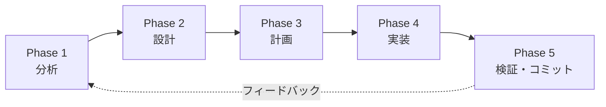
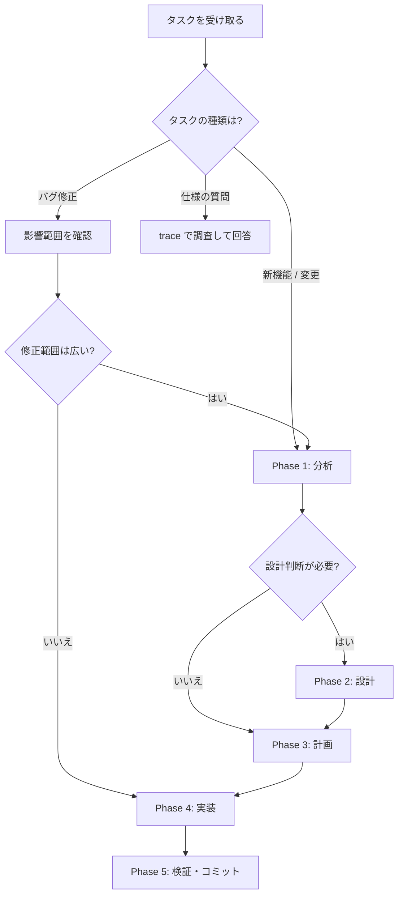

# 開発ライフサイクル管理スキル

## 概要

このスキルは、Doorstop + Gherkin + Spec-Weaver で仕様管理されたプロジェクトにおいて、
**開発ワークフロー全体の手順（When / What / Order）**を定義する。

### doorstop-gherkin-skill との関係

| スキル | 担当領域 | 問い |
|---|---|---|
| **doorstop-gherkin-skill** | 仕様管理の方法論 | How（YAMLの書き方、Gherkinの構文、Spec-Weaverの使い方） |
| **dev-lifecycle（本スキル）** | 開発ワークフロー | When / What / Order（いつ・何を・どの順で行うか） |

仕様の具体的な操作手順（YAML編集、`.feature` 作成、`doorstop` コマンド）は
**doorstop-gherkin-skill に委譲**する。本スキルはそれらの操作を**いつ・どの順序で行うか**を定める。

---

## 拡張ドキュメント階層

標準の REQ → SPEC 階層に加え、以下のドキュメント型を SPEC の下に配置できる。
REQ-AUTHやAUTH-REQ, PAY-REQなど、標準のREQ -> SPEC以外にも要件や仕様が作成されていることがある。

```text
REQ（ビジネス要件）
└── SPEC（システム仕様）
    ├── DESIGN（設計ドキュメント）   — アーキテクチャ・コンポーネント設計
    ├── PLAN（実装計画）             — タスク分解・順序・見積り
    ├── ADR（Architecture Decision Record） — 技術選定の記録
    └── RESEARCH（調査メモ）         — 技術調査・PoC結果
```

| ドキュメント型 | Doorstop prefix | 親 | 用途 |
|---|---|---|---|
| DESIGN | `DESIGN` | SPEC | アーキテクチャ図、コンポーネント分解、インターフェース定義 |
| PLAN | `PLAN` | SPEC | 実装タスクの分解・順序・依存関係 |
| ADR | `ADR` | SPEC | 技術選定の理由・却下案・帰結の記録 |
| RESEARCH | `RESEARCH` | SPEC | 技術調査、PoC結果、ベンチマーク |

> 各型の詳細なテンプレートとセットアップ手順は `references/document-types.md` を参照。

---

## ライフサイクル 5フェーズ



| Phase | 名称 | 主な成果物 | 判定基準（次フェーズへの条件） |
|---|---|---|---|
| 1 | **分析** | 影響範囲の特定、既存仕様の確認 | 関連するREQ/SPECを全て把握した |
| 2 | **設計** | DESIGN / ADR / RESEARCH ドキュメント | 設計方針が決定し、ユーザー承認を得た |
| 3 | **計画** | PLAN ドキュメント（タスク分解） | 実装手順が明確で、ユーザー承認を得た |
| 4 | **実装** | コード変更、REQ/SPEC/feature の更新 | 全タスク完了、テスト通過 |
| 5 | **検証・コミット** | audit 通過、コミット | 全検証パス、コミット完了 |

> 実際に行うときは、必ず `references/workflow-phases.md` を参照すること。

---

## Phase 1: 分析

**目的**: 変更の影響範囲を把握し、既存の仕様体系との関係を明確にする。

### やること

1. ユーザーの要求を理解する
2. 既存の REQ / SPEC / `.feature` をスキャンし、関連アイテムを特定する
3. コードベースを調査し、影響を受けるモジュールを特定する
4. 分析結果をユーザーに報告する

### 主なコマンド

```bash
# 既存仕様の確認
spec-weaver trace <関連ID> -f ./specification/features

# ステータス確認
spec-weaver status

# コードベース調査
# （Grep / Glob / Read ツールを使用）
```

### 判定基準

- [ ] 関連する REQ / SPEC を全てリストアップした
- [ ] 影響を受けるコードモジュールを特定した
- [ ] 新規 REQ / SPEC の追加が必要かどうか判断した
- [ ] 分析結果をユーザーに報告し、方向性の合意を得た

---

## Phase 2: 設計

**目的**: 実装方針を決定し、必要に応じて設計ドキュメントを作成する。

### やること

1. 新規/更新が必要な REQ / SPEC を doorstop-gherkin-skill の手順で作成・更新する
2. 規模に応じて DESIGN / ADR / RESEARCH ドキュメントを作成する（後述の規模判定を参照）
3. `.feature` ファイルの追加・更新が必要か判断する
4. 設計方針をユーザーに提示し、承認を得る

### 規模に応じたドキュメント作成判定

| 規模 | DESIGN | ADR | RESEARCH | PLAN |
|---|---|---|---|---|
| **大規模**（複数モジュール横断） | 必須 | 必要に応じて | 必要に応じて | 必須 |
| **中規模**（単一モジュール内の大きな変更） | 推奨 | 必要に応じて | — | 推奨 |
| **小規模**（数ファイルの変更） | — | — | — | 任意 |
| **バグ修正** | — | — | — | — |

### 判定基準

- [ ] REQ / SPEC の新規追加・更新が完了した
- [ ] 必要な設計ドキュメント（DESIGN / ADR / RESEARCH）を作成した
- [ ] `.feature` ファイルの更新方針を決定した
- [ ] 設計方針についてユーザーの承認を得た

---

## Phase 3: 計画

**目的**: 実装タスクを分解し、実行順序を明確にする。

### やること

1. 実装タスクを具体的なステップに分解する
2. 中〜大規模の場合は PLAN ドキュメントを Doorstop に作成する
3. タスクの依存関係と実行順序を整理する
4. 計画をユーザーに提示し、承認を得る

### PLAN ドキュメントの活用（Plan-as-Spec）

実装計画を PLAN ドキュメントとして Doorstop に永続化することで：
- 計画の変更履歴が Git で追跡される
- SPEC との紐付けにより、なぜそのタスクが必要かが明確になる
- 完了後も「どう実装したか」の記録として残る

```bash
# PLANドキュメントの作成（初回のみセットアップが必要）
doorstop add PLAN
doorstop link PLAN-001 SPEC-001
```

### 判定基準

- [ ] 実装タスクが具体的なステップに分解された
- [ ] タスクの実行順序と依存関係が明確になった
- [ ] ユーザーの承認を得た

---

## Phase 4: 実装

**目的**: 計画に沿ってコードを変更し、仕様を同期させる。

### やること

1. 計画に沿ってコードを変更する
2. 仕様の更新が必要な場合は doorstop-gherkin-skill の手順に従う
3. `.feature` ファイルを追加・更新する
4. 関連する REQ / SPEC の `status` を `in-progress` に更新する
5. `updated_at` を更新する

### 実装中の仕様同期ルール

- コードの変更に伴い SPEC の内容が変わる場合は、**コードと同時に SPEC も更新する**
- 新しい振る舞いを追加した場合は、`.feature` のシナリオも追加する
- 仕様の更新手順は doorstop-gherkin-skill に従う

### 判定基準

- [ ] 計画の全タスクが完了した
- [ ] テストが通過する
- [ ] 仕様（REQ / SPEC / `.feature`）がコードと同期している

---

## Phase 5: 検証・コミット

**目的**: 全ての整合性チェックを通過させ、変更をコミットする。

### やること

1. テストを実行する
2. Spec-Weaver の整合性チェックを実行する
3. Doorstop のバリデーションを実行する
4. 関連する REQ / SPEC の `status` を `implemented` に更新する
5. コミット規約に従ってコミットする

### 検証コマンドの実行順

```bash
# 1. ユニットテスト / 結合テスト
uv run pytest tests/ -q

# 2. Spec-Weaver 監査（仕様 ↔ Gherkin の整合性）
uv run spec-weaver audit ./specification/features

# 3. Doorstop バリデーション（リンク整合性）
doorstop

# 4. ドキュメント再生成（任意）
uv run spec-weaver build ./specification/features --out-dir .specification
```

### コミット規約

コミットメッセージは **Conventional Commits** 形式に従う。
scope に仕様ID（SPEC-xxx, PLAN-xxx 等）を記載する。

```
feat(SPEC-001): パスワードハッシュ化ロジックを実装

- bcrypt を使用したハッシュ化処理を追加
- SPEC-001 の要件を満たすバリデーションを実装
```

> 詳細は `references/commit-conventions.md` を参照。

### ステータス更新

```bash
# 完了した SPEC の status を implemented に更新
# （doorstop edit SPEC-001 またはYAML直接編集）

# 確認
spec-weaver status
```

### 判定基準

- [ ] 全テストが通過した
- [ ] `spec-weaver audit` が exit code 0 を返した
- [ ] `doorstop` バリデーションが通過した
- [ ] 関連する REQ / SPEC の `status` を `implemented` に更新した
- [ ] `updated_at` を更新した
- [ ] コミット規約に従ったコミットメッセージで変更をコミットした

---

## Doorstop 拡張ドキュメントのセットアップ

拡張ドキュメント型（DESIGN / PLAN / ADR / RESEARCH）を使用する場合、
プロジェクトで初回のみ以下のセットアップが必要。

```bash
# DESIGN ドキュメントの作成
doorstop create DESIGN ./specification/designs --parent SPEC

# PLAN ドキュメントの作成
doorstop create PLAN ./specification/plans --parent SPEC

# ADR ドキュメントの作成
doorstop create ADR ./specification/adrs --parent SPEC

# RESEARCH ドキュメントの作成
doorstop create RESEARCH ./specification/research --parent SPEC
```

セットアップ後、各ディレクトリの `.doorstop.yml` で `sep: '-'` を確認する。

> 各ドキュメント型のテンプレートと使い分けは `references/document-types.md` を参照。

---

## ワークフロー判定フローチャート

ユーザーからタスクを受け取った際に、どのフェーズから開始するかを判定する。



### 判定の指針

- **即座に Phase 4 に進めるケース**: 1〜2ファイルの小さなバグ修正、typo修正
- **Phase 1 から開始するケース**: 新機能の追加、既存機能の大幅な変更
- **Phase 2 が必要なケース**: 技術選定が伴う、アーキテクチャに影響する変更
- **Phase 3 が必要なケース**: 3つ以上のファイルを変更する、複数ステップが必要

---

## 他スキルとの連携

| 操作 | 担当スキル | 備考 |
|---|---|---|
| REQ / SPEC の YAML 作成・編集 | doorstop-gherkin-skill | `doorstop add` / `doorstop edit` の手順 |
| `.feature` ファイルの作成・編集 | doorstop-gherkin-skill | Gherkin 構文、タグ付けルール |
| Spec-Weaver コマンドの使い方 | doorstop-gherkin-skill | `audit` / `build` / `status` / `trace` |
| 開発フェーズの進行管理 | **dev-lifecycle（本スキル）** | フェーズ判定、チェックリスト |
| コミットメッセージの規約 | **dev-lifecycle（本スキル）** | Conventional Commits 形式 |
| 拡張ドキュメントの管理 | **dev-lifecycle（本スキル）** | DESIGN / PLAN / ADR / RESEARCH |

---

## 参照ファイル

| ファイル | 読むタイミング |
|---|---|
| `references/workflow-phases.md` | 各フェーズの詳細手順・チェックリストを確認するとき |
| `references/commit-conventions.md` | コミットメッセージを作成するとき |
| `references/document-types.md` | DESIGN / PLAN / ADR / RESEARCH を作成するとき |
