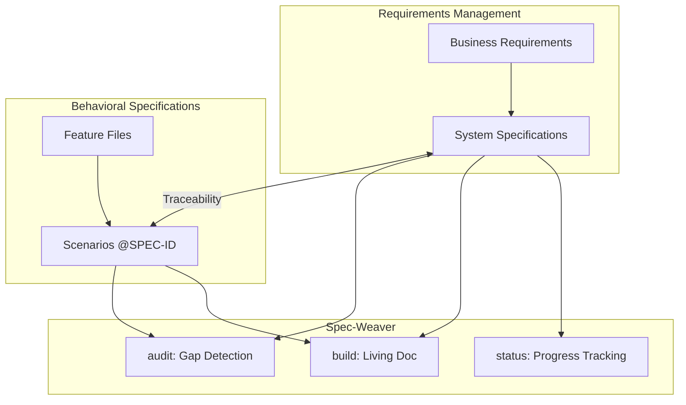

# [REQ-001] 要件、仕様と実装（テスト）のトレーサビリティ保証

**実装状況**: ✅ implemented

**作成日**: 2026-02-26　|　**更新日**: 2026-02-26

**下位アイテム**: [REQ-002](REQ-002.md), [REQ-003](REQ-003.md), [REQ-007](REQ-007.md), [REQ-009](REQ-009.md), [REQ-011](REQ-011.md), [REQ-012](REQ-012.md), [SPEC-001](SPEC-001.md), [SPEC-002](SPEC-002.md), [SPEC-021](SPEC-021.md)

**テストカバレッジ**: 🟢 2/2 (100%) （下位アイテムの集計）

### 内容

## 概要
要件管理ツール（Doorstop）のIDと、振る舞い駆動テスト（Gherkin）のタグを紐付け、
双方向の追跡を可能にすること。

## 背景・動機
ソフトウェア開発においては、ビジネス要件からシステム仕様、そしてテストまでの
一貫したトレーサビリティが品質保証の要となる。Doorstop（YAML形式の要件管理）と
Gherkin（.feature形式の振る舞い仕様）を統合し、仕様IDとテストタグの双方向追跡を
実現することで、仕様漏れやテスト漏れを構造的に防止する。

## システム概念図

## 受け入れ基準
- DoorstopのSPEC IDとGherkinの@タグが1対1で紐付けできること
- 任意のSPEC IDから対応するテストシナリオを特定できること
- 任意のGherkinタグから対応する仕様書を特定できること
