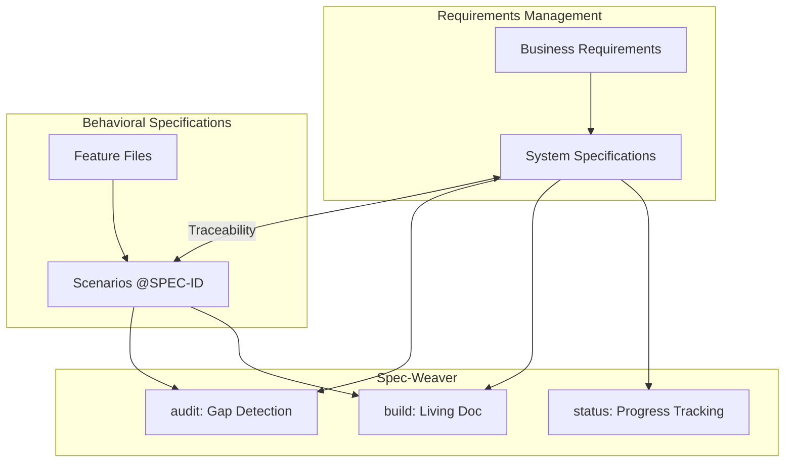

# [REQ-001] 要件、仕様と実装（テスト）のトレーサビリティ保証

> ⚠️ **Suspect**: 関連するアイテムやテストが変更されました。影響範囲のレビューが必要です。
> **原因 (Unreviewed)**: [SPEC-020](SPEC-020.md), [audit.feature](../features/audit.md), [build.feature](../features/build.md), [ci.feature](../features/ci.md), [data_extraction.feature](../features/data_extraction.md), [impl_link.feature](../features/impl_link.md), [scaffold.feature](../features/scaffold.md), [status.feature](../features/status.md), [timestamp.feature](../features/timestamp.md), [trace.feature](../features/trace.md)

**実装状況**: ✅ implemented

**作成日**: 2026-02-26　|　**更新日**: 2026-02-26

**下位アイテム**: [REQ-007](REQ-007.md), [REQ-003](REQ-003.md), [REQ-002](REQ-002.md), [REQ-009](REQ-009.md), [REQ-011](REQ-011.md), [REQ-012](REQ-012.md), [SPEC-001](SPEC-001.md), [SPEC-002](SPEC-002.md), [SPEC-021](SPEC-021.md)

**テストカバレッジ**: 🟢 2/2 (100%) （下位アイテムの集計）

### 内容

## 概要
要件管理ツール（Doorstop）のIDと、振る舞い駆動テスト（Gherkin）のタグを紐付け、
双方向の追跡を可能にすること。

## 背景・動機
ソフトウェア開発においては、ビジネス要件からシステム仕様、そしてテストまでの
一貫したトレーサビリティが品質保証の要となる。Doorstop（YAML形式の要件管理）と
Gherkin（.feature形式の振る舞い仕様）を統合し、仕様IDとテストタグの双方向追跡を
実現することで、仕様漏れやテスト漏れを構造的に防止する。

## システム概念図

```mermaid
graph TD
    subgraph Doorstop [Requirements Management]
        REQ[Business Requirements] --> SPEC[System Specifications]
    end

    subgraph Gherkin [Behavioral Specifications]
        FEAT[Feature Files] --> SCEN[Scenarios @SPEC-ID]
    end

    subgraph SpecWeaver [Spec-Weaver]
        AUDIT[audit: Gap Detection]
        BUILD[build: Living Doc]
        STATUS[status: Progress Tracking]
    end

    SPEC <-->|Traceability| SCEN
    SPEC --> AUDIT
    SCEN --> AUDIT
    SPEC --> BUILD
    SCEN --> BUILD
    SPEC --> STATUS
```

## 受け入れ基準
- DoorstopのSPEC IDとGherkinの@タグが1対1で紐付けできること
- 任意のSPEC IDから対応するテストシナリオを特定できること
- 任意のGherkinタグから対応する仕様書を特定できること

**テスト実行結果 (集計)**: ✅ 20/20 PASS
