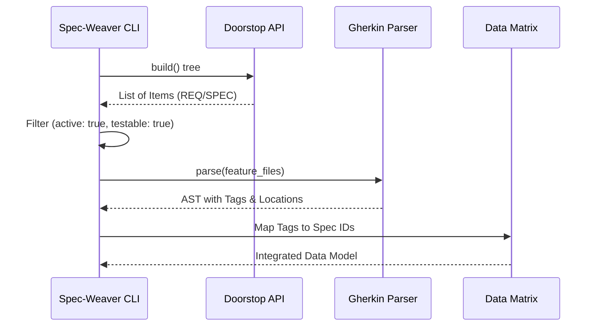

# [SPEC-002] データ抽出基盤

**実装状況**: ✅ implemented

**作成日**: 2026-02-26　|　**更新日**: 2026-02-27

**上位アイテム**: [REQ-001](REQ-001.md), [REQ-002](REQ-002.md) / **兄弟アイテム**: [SPEC-001](SPEC-001.md), [SPEC-003](SPEC-003.md), [SPEC-013](SPEC-013.md), [SPEC-021](SPEC-021.md)

**テスト対象**: Yes　**個別カバレッジ**: 🟢 1/1 (100%)

### 内容

## 概要
Doorstop と Gherkin からのデータ抽出基盤を定義する。

## データ抽出フロー

## 詳細仕様

### Doorstopの解析
- 正規表現でのYAMLパースは行わず、Doorstopの公式Python API（`doorstop.build()`）を使用すること
- `Tree` -> `Document` -> `Item` の構造を正しく走査すること

### Gherkinの解析
- `gherkin-official` パーサーを用いて抽象構文木（AST）を構築すること
- タグの文字列だけでなく、そのタグが属する「シナリオ名」「ファイル相対パス」「行番号」の
  メタデータを正確に抽出すること
- Gherkin のタグ継承（Effective Tags）に関する詳細仕様は **SPEC-021** を参照すること

### カスタム属性の評価
- Doorstopの `testable: false` 属性を評価すること
- UIの色やライセンス表記など「自動テスト不可能な仕様」を監査の対象外（スキップ扱い）
  として処理すること

**テスト実行結果 (個別)**: ✅ 8/14 PASS

### 🧪 検証シナリオ

- ✅ PASS **Doorstop APIによる仕様ID集合の取得** — Scenario （[features/data_extraction.feature:7](../features/data_extraction.md)）
- ✅ PASS **非アクティブなアイテムの除外** — Scenario （[features/data_extraction.feature:12](../features/data_extraction.md)）
- ✅ PASS **テスト不可能な仕様の除外** — Scenario （[features/data_extraction.feature:17](../features/data_extraction.md)）
- ✅ PASS **プレフィックスによるフィルタリング** — Scenario （[features/data_extraction.feature:22](../features/data_extraction.md)）
- ✅ PASS **Gherkin ASTからのタグ抽出** — Scenario （[features/data_extraction.feature:29](../features/data_extraction.md)）
- ✅ PASS **Feature・Scenario両レベルのタグ抽出** — Scenario （[features/data_extraction.feature:34](../features/data_extraction.md)）
- ✅ PASS **サブディレクトリ内のfeatureファイルの再帰探索** — Scenario （[features/data_extraction.feature:39](../features/data_extraction.md)）
- ✅ PASS **Gherkin構文エラーの検出** — Scenario （[features/data_extraction.feature:44](../features/data_extraction.md)）
- - **Featureタグのみが付与されたfeatureファイルでScenarioがタグマップに登録される** — Scenario （[features/data_extraction.feature:54](../features/data_extraction.md)）
- - **Featureタグを継承したエントリのkeywordはScenarioになる** — Scenario （[features/data_extraction.feature:60](../features/data_extraction.md)）
- - **Feature→Rule→Scenarioの多段継承でEffective Tagsが正しく算出される** — Scenario （[features/data_extraction.feature:66](../features/data_extraction.md)）
- - **シナリオ自身のタグと継承タグが共存してEffective Tagsを形成する** — Scenario （[features/data_extraction.feature:73](../features/data_extraction.md)）
- - **Scenario Outlineの全ExamplesタグがEffective Tagsに集約される** — Scenario （[features/data_extraction.feature:80](../features/data_extraction.md)）
- - **プレフィックスフィルタはEffective Tags算出後に適用される** — Scenario （[features/data_extraction.feature:87](../features/data_extraction.md)）