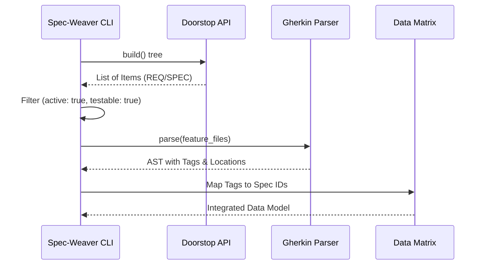

# [SPEC-002] データ抽出基盤

**実装状況**: ✅ implemented

**上位アイテム**: [REQ-001](REQ-001.md), [REQ-002](REQ-002.md) / **兄弟アイテム**: [SPEC-001](SPEC-001.md), [SPEC-003](SPEC-003.md)

**テスト対象**: Yes　**個別カバレッジ**: 🟢 1/1 (100%)

### 内容

## 概要
Doorstop と Gherkin からのデータ抽出基盤を定義する。

## データ抽出フロー

## 詳細仕様

### Doorstopの解析
- 正規表現でのYAMLパースは行わず、Doorstopの公式Python API（`doorstop.build()`）を使用すること
- `Tree` -> `Document` -> `Item` の構造を正しく走査すること

### Gherkinの解析
- `gherkin-official` パーサーを用いて抽象構文木（AST）を構築すること
- タグの文字列だけでなく、そのタグが属する「シナリオ名」「ファイル相対パス」「行番号」の
  メタデータを正確に抽出すること

### カスタム属性の評価
- Doorstopの `testable: false` 属性を評価すること
- UIの色やライセンス表記など「自動テスト不可能な仕様」を監査の対象外（スキップ扱い）
  として処理すること

### 🧪 検証シナリオ

- **データ抽出基盤** — Feature （[features/data_extraction.feature:2](../features/data_extraction.md)）